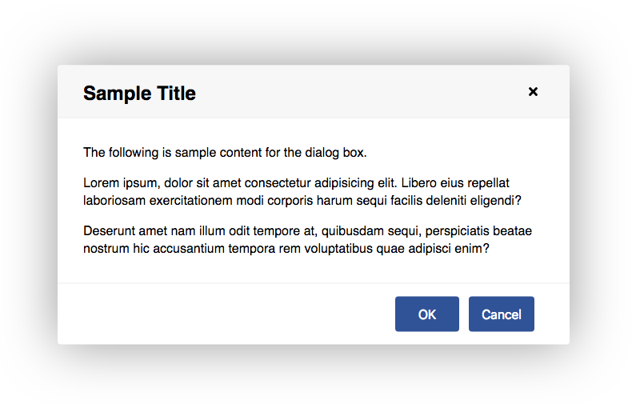

# Raven Dialog for Angular

An Angular dialog box component that makes use of the HTML &lt;dialog&gt; element for improved accessibility.



## Features

* Keyboard/touch accessible
* Easily styled with CSS variables
* Use CSS transforms to customize open/close transitions

## Installation

Install into your Angular project using NPM.

`npm install raven-dialog --save`

Import the **DialogModule** into your module.

```ts
import { DialogModule } from 'raven-dialog';

@NgModule({
  imports: [
    DialogModule,
    // ...
  ],
  // ...
})
export class AppModule { }
```

## Usage

Add a &lt;raven-dialog&gt; element to your template, and open or close it by binding a variable to the `open` attribute.

```ts
import { Component } from '@angular/core';

@Component({
  selector: 'app-root',
  template: `
    <raven-dialog heading="Sample Title"
      [(open)]="isOpen"
      [modal]="true">
      <p>Dialog box content here.</p>
    </raven-dialog>
  `,
  styles: []
})
export class AppComponent {
  isOpen = false;
}
```

### Options
| Option  | Type    | Description                                            | Default Value
| :------ | :------ | :----------------------------------------------------- | :------------
| heading | string  | An optional heading to place at the top of the dialog. | ""
| open    | boolean | Whether the dialog is open or not.                     | false
| modal   | boolean | Whether the dialog should be modal or not.             | false

### Styling

CSS variables are used for styling. Example:

```css
raven-dialog {
  --dialog-border: 2px solid #ccc;
  --dialog-border-radius: 5px;
}
```

#### Available CSS Variables
| Variable                      | Description                                  | Default Value
| :---------------------------- | :------------------------------------------- | :------------
| --dialog-margin               | Minimum left/right margin of the dialog box. | 2rem
| --dialog-padding              | Padding around the dialog box content.       | 2rem;
| --dialog-min-width            | Minimum width of the dialog box.             | 20rem
| --dialog-max-width            | Maximum width of the dialog box.             | 40rem
| --dialog-border               | Border around the dialog box.                | 0
| --dialog-border-radius        | Border radius of dialog box.                 | .25rem
| --dialog-transition-in        | Transition when opening dialog box.          | transform .2s ease-out, opacity .1s ease-out, box-shadow .2s |ase-out
| --dialog-transition-out       | Transition when closing dialog box.          | transform .2s ease-in, opacity .2s ease-in, box-shadow .2s ease-in
| --dialog-transform            | Transform property of dialog box.            | scale(1)
| --dialog-transform-in         | Transform property when transitioning in.    | scale(.9)
| --dialog-transform-out        | Transform property when transitioning out.   | scale(.9)
| --dialog-opacity              | Opacity of dialog box.                       | 1
| --dialog-opacity-in           | Dialog opacity when transitioning in.        | 0
| --dialog-opacity-out          | Dialog opacity when transitioning out.       | 0
| --dialog-box-shadow           | Box shadow around dialog box.                | 0 0 7rem rgba(0, 0, 0, .4)
| --dialog-box-shadow-in        | Box shadow when transitioning in.            | 0 0 0 rgba(0, 0, 0, 0.6)
| --dialog-box-shadow-out       | Box shadow when transitioning out.           | 0 0 0 rgba(0, 0, 0, 0.6)
| --dialog-header-padding       | Amount of padding in the header.             | 1rem 2rem
| --dialog-header-color         | Text color of the header.                    | #000
| --dialog-header-background    | Background of the header.                    | #f7f7f7
| --dialog-header-border-bottom | Border under the header.                     | 1px solid #eee
| --dialog-backdrop-background  | Background of the modal backdrop.            | rgba(0, 0, 0, .2)

## Browser Compatibility

Many browsers do not have native support for the &lt;dialog&gt; element and will require a polyfill. Check the [Can I Use](https://caniuse.com/#feat=dialog) database for current compatibility.

The [dialog-polyfill](https://www.npmjs.com/package/dialog-polyfill) polyfill is recommended and is supported by raven-dialog. Follow these steps to install it.

1. `cd` to your project's root directory.
1. Run: `npm install dialog-polyfill --save`
1. Update your **angular.json** file to include the style sheet and JavaScript file from the polyfill.
   ```json
   "styles": [
     "node_modules/dialog-polyfill/dialog-polyfill.css"
   ],
   "scripts": [
     "node_modules/dialog-polyfill/dialog-polyfill.js"
   ],
   ```

## Development

To contribute to the development of this component, clone this repository and run `npm install`. Then run `ng serve -o` to start a development server and to open a sample page in your browser.

## License

MIT license.
